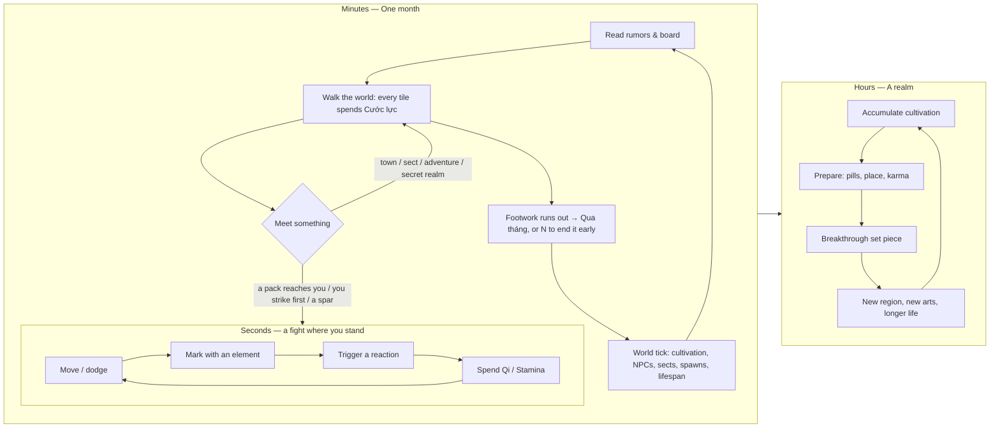

# Tu Tiên Lục — Game Design Document (v0.3)

> **Status:** draft for review · **Date:** 2026-09-24
> **Locked decisions:** Godot 4.7 + C# · PC / Steam first · Tale of Immortal–style sandbox · **a real 2D top-down (¾ view) world**
> **Our pillars on top of ToI:** AI storyteller (Linh Thức) · Qi + Body cultivation · Ngũ Hành elemental combat · Karma & sect wars
>
> **v0.2 changes:** the world is no longer a token on a tile map. You walk your cultivator through a painted top-down world with WASD. **Fights happen where you meet** (no separate arena screen), and **time flows as you travel**: crossing ground spends footwork, and when the month's footwork runs out the month turns by itself while you keep walking. See §7.1–7.3 and §9.3.
>
> **v0.3 changes:** sound and music are made in code (synthesized effects, generated guzheng-style music that follows the situation); a settings screen; **sword flight** (*Ngự kiếm*, **V**) from Trúc Cơ over rivers and peaks; the seasons in the air (petals, butterflies, leaves, snow) and underfoot; a painted, living title screen. See §7.2, §8 and §9.3.

---

## TL;DR

Today *Tu Tiên Lục* is an AI-narrated choose-your-path story. Every action is a menu pick followed by a 5–30 s LLM call (`/api/turn`). The world (regions, secret realms, sects, events) is mostly data the AI is *told about*, not a place you move through.

The redesign turns it into a **sandbox you control directly**, using *Tale of Immortal* (Guigu Bahuang) as the structural reference:

1. **A world you walk.** You steer your cultivator with WASD through hand-built regions drawn top-down (¾ view): forests, rivers, villages, sect halls. Each month has a travel budget (*Cước lực*). Crossing ground spends it, and when it runs out the month turns and the whole world advances.
2. **Real-time combat where you meet.** Beasts roam, people stroll, and a fight starts right there when a pack reaches you or you strike first. It's top-down action with WASD + mouse: martial arts, spirit arts, dash and ultimate, plus five-element reactions and realm suppression. Trees and walls block movement and projectiles, and you can run away.
3. **A living world.** NPC cultivators, sects and wars move forward every month whether you act or not. You hear about it as rumors, and your deeds ripple outward through a karma ledger.
4. **Our storyteller.** The AI stops being the game engine and becomes *Linh Thức*. It writes dialogue, adventures, rumors, chronicles and heart-demon trials. Deterministic rules decide every outcome.

The good news: **most of ToI's systems already exist in this repo** as data and types. That includes realms and stages, spirit roots, techniques, skills, 5 tiered regions with 4 areas each, 5 multi-floor secret realms, 18 authored adventure events, sects with ranks, missions and wars, lifespan, injuries and breakthrough preparation. Many of them are not wired into gameplay yet. **The redesign gives them a map and a clock.**

---

## 1. Decisions

| Decision | Choice | Why |
|---|---|---|
| Engine | **Godot 4.7 (.NET build) + C#** | 2D-first engine; strong UI and text shaping (Vietnamese diacritics); MIT license with no fees; runtime content packs make mods easy; C# is a near-mechanical port of the existing TypeScript rules; it runs headless in CI (and in our cloud sessions). |
| Rules code | **Engine-free C# library** (`TuTien.Core`, netstandard2.1, C# 9) | Unit-testable without the engine, and it drops into Unity 6 unchanged if we ever switch. |
| First platform | **PC / Steam** (Windows first, Linux/Steam Deck next) | Matches ToI: keyboard + mouse action and dense menus. Godot's C# projects can't be exported to the web, which is fine for PC-first. |
| Backend | **Keep Next.js + Supabase** as the service layer | Accounts, cloud saves and the AI gateway (API keys must never ship in the client). The game is fully playable offline. |
| View | **2D top-down, ¾ perspective**, one continuous field per region (128 px per map tile) | You see and steer your character in the world itself, like an action RPG, instead of moving a token on a board. |
| Combat | **Real-time, seamless**: fights happen on the field where you meet (ToI-style kit) | "Control the character" is the goal. Turn-based menus are what we're replacing, and a separate arena screen breaks the feeling of one world. |
| Time | **Time flows as you travel** | Crossing a tile spends its footwork; an empty budget turns the month automatically. The strategic clock stays monthly and deterministic. |
| Art direction | **Ink wash & jade** (existing design system), drawn procedurally in-engine for now | Brush-outlined figures, trees and buildings plus painted-ground shaders cost no asset pipeline and keep one style; commissioned sprites can replace them piece by piece. |
| Audio | **Synthesized in code** for now: effects, and music generated in Chinese pentatonic modes on a plucked-zither voice | Same reasoning as the art: no asset pipeline and one voice throughout. A composer's recordings can replace any piece behind the same `SoundBoard` calls. |

---

## 2. Where the game is today

A condensed audit of what the redesign changes, with file references.

**How play works now**

- The loop is: `useGameState.processTurn` → `POST /api/turn` → LLM → narrative + 2–5 choices + "proposed deltas", which the server clamps and applies. **Every action waits on the model** (90 s client timeout). See `src/app/api/turn/route.ts` and `src/lib/ai/`.
- Movement is either a menu (`WorldMap` → `/api/travel`) or a side-effect of AI text (a `location.place` delta → `syncTravelWithLocation`).
- Combat is a turn-based menu that runs **on the client** with `Math.random()` (`src/hooks/useCombat.ts`). The result is saved by `PUT /api/run/[id]`, which overwrites the entire game state with whatever the client sends, with no validation (`src/app/api/run/[id]/route.ts`). There are **three different damage formulas**: `lib/game/combat.ts`, active combat and test combat in `useCombat.ts`.
- Secret realms are button menus. `clear_floor` and `defeat_boss` can be called without fighting (`src/app/api/dungeon/route.ts`), and only the first enemy of a wave is ever fought (`useTravelHandlers.ts`).

**Content and systems that aren't connected**

- **There is no enemy catalog.** Areas and dungeons reference 71 enemy IDs; only 10 have stats (`generateEnemyFromId`), and the rest fall back to a generic 60 HP / 20 ATK / 10 DEF.
- **The random-event engine is dead code.** It has 18 authored events (`lib/world/events.ts`) and a complete engine (`event-engine.ts`), but `tryTriggerEvent` is never called. None of the 59 `event_pool` IDs in `regions.ts` match an authored event.
- **The activity simulator is unused.** That's 1,081 lines in `lib/game/activities.ts`, plus `ActivitySelector` and `CultivatorDashboard`. Neither component is mounted anywhere.
- **Breakthroughs are automatic and riskless** (`performBreakthrough`). The `BreakthroughPreparation` / `BreakthroughOutcome` types are unused.
- **Several typed state blocks are never written:** world simulation (rumors, NPC changes), multi-faction reputations, and gathered resources.
- **NPCs are an AI-maintained memory list** (`KnownNPC`, max 15), not people who exist in the world.

**Other friction**

- Stamina regenerates in **real time** (20 per minute), which acts as a mobile-style energy gate on AI spend. That no longer makes sense once actions stop costing an LLM call.
- The qi + body path is called "Song Tu" in the UI. In Vietnamese xianxia, *song tu* usually means paired cultivation with a Dao partner. See the naming note in §7.6.

**What carries over:** all content data, most rules (realm tables, exp curves, spirit-root and technique multipliers, time and season bonuses, loot tables, sect missions and wars, dual-cultivation math, enhancement), the prompt engineering (context builder, arcs, NPC registry, anti-repetition), the design system, and Supabase auth and DB. See §10.

---

## 3. Tale of Immortal, deconstructed

*Tale of Immortal* (Guigu Bahuang, Guigu Studio, 2021, built in Unity) is the structural reference. At the level we borrow from, it has:

| ToI system | How it plays |
|---|---|
| **World map + monthly move budget** | You move a token across large regional maps. Each month you have limited movement, then you end the month and the world advances. Regions are gated by cultivation realm. |
| **Time and lifespan** | Everything costs months: travel, seclusion, crafting. Age accumulates, each realm extends max lifespan, and running out of lifespan ends the run. |
| **Real-time combat** | Separate top-down arenas. The kit is a basic martial art, spirit/secret arts, an ultimate, a step (dash) art and passive heart methods; divine powers and artifacts come at higher realms. |
| **Living NPCs** | Hundreds of named cultivators with personalities who cultivate, break through, form friendships, sworn bonds, master–disciple ties, Dao partnerships and feuds, then die. A rumor feed reports it. |
| **Set-piece breakthroughs** | Major realms are special events (forming a foundation or core, heart-demon trials, tribulations). The quality of the outcome matters. |
| **Sects, towns, secret realms, adventures** | Sects have ranks, missions and contribution. Towns have shops and auctions. Periodic secret realms. Fortuitous encounters on the map. |
| **Destinies (khí vận)** | Innate traits rolled at creation, plus acquired traits from events. |
| **Life skills** | Alchemy, refining, feng shui, talismans, herbology, mining. |
| **Modding** | Steam Workshop support is a large part of the game's longevity. |

**What we don't copy:** ToI's scale (hundreds of NPCs × 10 realms × huge maps), its grindy aptitude matrices, and its item-grade sprawl. We aim for ToI's *structure* at indie scale. We also add what ToI can't do: a storyteller that writes unique, *remembered* stories within its rules.

---

## 4. ToI's skeleton, our soul

| Layer | Taken from ToI | Our version / our idea | Reuses |
|---|---|---|---|
| Strategy | Month turn, move budget, lifespan | *Cước lực* budget; **Thần thức** (spiritual sense) fog-of-war radius; sword-flight at Trúc Cơ changes movement rules | `regions.ts`, `travel.ts`, `time.ts`, `LifespanInfo` |
| Combat | Top-down action, slot-based kit | **Ngũ Hành marks & reactions**, **realm suppression**, body arts that spend Stamina | `Skill` data, `combat.ts` formulas (unified) |
| Cultivation | Months of seclusion, set-piece breakthroughs | **Qi + Body kiêm tu** builds; karma-scaled tribulations; AI-written heart demon | `mechanics.ts` tables, `dual-cultivation.ts`, breakthrough types |
| World | NPC sim, rumors | **Karma ledger** (ân/oán debts that NPCs repay or avenge); **sect war territory** on the map | `KnownNPC`, `sects.ts`, `sect-wars.ts`, `WorldSimulationState` |
| Story | Authored events | **Linh Thức**: AI writes dialogue, adventures, chronicle, heart-demon trials — validated by rules | `prompts.ts` context builder, `events.ts` schema |
| Identity | Anime-painted look | **Ink wash, seals with drawn icons, Hán-Việt terms written in Vietnamese** (no Chinese characters on screen), Vietnamese-first | `design/` system, i18n |

---

## 5. Pillars

1. **Hands on the sword.** You move and you fight. No outcome that depends on player skill is decided by a menu or the AI.
2. **Time is the true currency.** Months are spent on travel, seclusion, secret realms and crafting. Lifespan makes every month count.
3. **The world lives without you.** NPCs, sects and wars advance every month, and your deeds leave traces that come back to you.
4. **The storyteller colors, Heaven's Dao decides.** *AI đề xuất, Thiên Đạo phán quyết.* The AI proposes content inside strict schemas, and deterministic rules resolve it.
5. **Everything flows through Ngũ Hành and Nhân Quả.** The five elements and karma are the two threads connecting combat, cultivation, NPCs and story.

---

## 6. Core loops



- **Moment (seconds):** a readable action fight. Telegraphs, dodges, elemental combos.
- **Month (2–5 min):** a strategic puzzle. Where to spend 12–16 moves, what to fight, when to stop and seclude.
- **Realm (hours):** long-horizon goals: breakthroughs, sect rank, relationships, story arcs, secret realm clears, all racing the lifespan clock.

A full run from mortal to peak Nguyên Anh targets **~360 in-game months (~30 years)**, or roughly **20–35 hours** of play for the main path.

---

## 7. Systems

### 7.1 Time and the month turn

- **The strategic tick is one month.** The calendar shows year and month. The day of the month is shown as a ratio of *Cước lực* spent (day = 1 + ⌊29 × spent / max⌋), so day-based flavor still works: day 15 is the full moon, day 21 of months 6 and 12 is a solstice.
- **Cước lực (footwork)** is the month's days of travel: `24 + ⌊AGI/2⌋ + 3 × realm index` (+ mount, later). Crossing into a tile costs that terrain's points (§7.2). Gathering and resting cost 1, entering a secret realm costs 2, and talking or trading is free. Fights don't cost time: the clock stops while you fight.
- **Time flows as you travel.** When the footwork left is less than the next tile costs, the month turns first (cultivation, world tick, autosave) and the walk goes on with a fresh budget. A card in the HUD sums up the month without stopping play. **Qua tháng** (N) ends the month early, for example to wait out a season in town.
- **Time bonuses** (existing `time.ts`) become a planning layer:
  - Season × element (e.g. Mộc +20% in spring) applies to that month's cultivation.
  - A full month of seclusion includes the full-moon night, so it gets the +25% moon bonus.
  - Month 1 gets the New Year +30%.
  - Months 6 and 12 get the solstice +20%.
  - Planning seclusion around these dates is intended strategy.
- **Lifespan:** age goes up every 12 months (existing `advanceTime` logic). Warnings come at 20 and 10 years left, and death of old age ends the run (§7.15).
- **Removed:** real-time stamina regen. Stamina becomes a combat resource (§7.3), and outside combat it's always full.

**Month resolution order**, which is deterministic and lives in the core library:

1. Pending activity (seclusion months, rest)
2. Player cultivation accrual → minor breakthroughs (auto) → flag a major breakthrough if capped
3. Recovery (HP and Qi to full in a safe zone, 50% elsewhere; injuries heal by time)
4. Calendar +1 month; age and lifespan
5. NPC simulation → rumors (§7.8)
6. Sect simulation: mission deadlines, war score, patrols, territory (§7.9)
7. Spawns: beasts move or respawn, adventures refresh, herbs regrow, secret realms open or close
8. Scheduled world events (auctions, tournaments, beast tides)
9. Queue storyteller jobs: chronicle and rumor prose (async, §7.13)
10. Autosave

### 7.2 The world (*Đại Địa*): a top-down field

- **One hand-built map per region** (5 regions, about 48×30 to 64×40 tiles each). The rules still see a grid of tiles (terrain, zone, footwork cost, fog), but **on screen each tile is 128 px of painted ground** in ¾ view, and you walk it freely with WASD:
  - The ground is one shader over the whole map: terrain blends with brushed, noise-warped edges; rivers get banks, foam and moving glints; roads and bridges are traced between connected tiles; seasons recolour grass, trees and snow.
  - Scenery comes from the tiles, placed by a hash so it never changes: two or three trees per forest tile (never a solid wall of trunks), rocks and pines on hills and mountains, reeds on the banks, cliffs along the region's rim and on snow peaks. Villages, sect grounds, caves and spirit veins are laid out by hand.
  - Trees, walls and cliffs are solid. Water blocks walking but not qi projectiles. Trees and roofs in front of you turn see-through so you never lose your character.
  - Ground speed follows terrain: roads are quicker, swamps and dense forest slower.
  - **Each tile you cross is charged to the rules** (`GameEngine.Travel`), so footwork, fog and the month clock stay exact and deterministic whatever the frame rate.
- Regions connect through **mountain passes** along the existing adjacency ring: Thanh Vân ↔ Hỏa Sơn ↔ Trầm Lôi ↔ Vọng Linh ↔ Huyền Thủy ↔ Thanh Vân.
- **Zones = the existing areas** (4 per region, 20 total), painted as tile regions. Each zone carries its `danger_level`, `is_safe`, `enemy_pool`, `event_pool`, `loot_table` and `cultivation_bonus` (qi density). `connected_areas` becomes real walking adjacency.
- **Terrain costs** (Cước lực per step):

| Terrain | Cost | Notes |
|---|---|---|
| Road / town / sect grounds | 1 | |
| Plains, meadow | 1 | |
| Forest | 2 | Beast ambush +10% |
| Hills | 2 | |
| Dense forest, swamp | 3 | |
| Mountain | 3 | Mortals can't cross peaks |
| River / sea | — | Bridges and ferries only, until **Ngự kiếm phi hành** (sword flight) at Trúc Cơ: every tile costs 1 and water becomes crossable |

- **Ngự kiếm phi hành (sword flight):** from Trúc Cơ, **V** puts you on your flying sword. You float over rivers, peaks and cliffs at about twice walking speed, and beasts on the ground can't reach you. You can't strike from the sword (land with V first; you can't land on water). A fight that finds you anyway brings you down to the nearest ground. The **M** map's travel takes to the sword by itself when the way crosses water and sets you down at the end.

- **Points of interest** are places you walk up to and press **E** at (the prompt floats over them):

| POI | On the field | Source data | Interaction |
|---|---|---|---|
| Town (*Thành/Trấn*) | Houses, an inn with a "Khách điếm" signboard, a market stall, a bounty board ("Cáo thị"), a well | `type: "city"` areas | Each building opens its part of the town (§7.10) |
| Sect gate (*Tông môn*) | A painted gate between cliffs, the main hall, a pagoda, training dummies | `NAMED_SECTS.home_region` | The hall: join, missions, treasury (§7.9) |
| Secret realm (*Bí cảnh*) | A cave mouth glowing violet under a turning spiral | `DUNGEONS[].area` | Enter the floors (§7.11) |
| Adventure (*Kỳ ngộ*) | A pillar of gold light under a star | zone `event_pool` + authored events | Event scene (§7.12) |
| Spirit vein (*Linh mạch*) | Jade crystals under a swirl of qi, or a spirit spring | new, per zone | Seclusion spot with high qi density |
| Herb / ore node | A herb patch with red berries when ripe | zone `loot_table` | Gather: 1 Cước lực, regrows in N months |
| Beast pack (*Yêu thú*) | The creatures themselves, prowling their patch | zone `enemy_pool` | Aggressive packs that see you give chase; contact or your first strike starts the fight |
| Wandering cultivator | The person, strolling (name shown when near) | NPC sim | Talk, gift, spar, fight (§7.8) |
| Mountain pass (*Cửa ải*) | A stone stele marked "Ải" where the road leaves the map | region adjacency | Travel to a neighboring region |

- **Fog of war and Thần thức (spiritual sense):**
  - Your sense radius is `3 + ⌊PER/4⌋ + realm index`. It permanently reveals terrain and shows live tokens (beasts, NPCs, adventures) within range.
  - Hidden POIs (hidden caves, secret chests) need a higher radius or a **Thần thức pulse** (spend Qi to scan a wider area once).
- **Clouds (*mây mù*)** cover what you haven't explored; they drift and part as your sense radius reveals tiles. The minimap and the **M** map show only what you have seen. Clicking a seen place on the M map plans the cheapest way there and your character walks it, stepping round whatever stands in the way (a fine-grained local path search around wells, boards and houses).
- **Encounters:**
  - Aggressive packs (chargers and swarms) notice you within about 3 tiles (more in dangerous zones), show a "!" and run at you; the first one to reach you starts the fight. They lose interest if you outrun them. Passive creatures only fight if you strike first. Nothing hunts you in a safe zone.
  - At month end, aggressive beasts within 3 tiles may move onto you (an ambush), with a chance to dodge based on PER. The ambushers step out of the trees around you and the fight starts at once.
  - Zones above your realm are shown in cinnabar, using the existing `getDangerWarning` logic.
- **Realm gating is soft, like ToI:** you *can* walk into Trầm Lôi as a Luyện Khí disciple, and you will probably die there.

### 7.3 Combat (*Chiến Đấu*)

**Fights happen where you meet.** There is no arena screen: the creatures, trees, rivers and walls around you are the battlefield. Trees and walls block movement and most projectiles (qi flies over water). When a fight starts, the bodies already on the field (the pack that caught you, the person you challenged) become the combatants, and anyone the encounter adds steps out of the mist nearby. The month clock stops until it ends, and a banner and a non-blocking result card report the outcome.

**The kit (slot-based, ToI-style, fed by existing data):**

| Slot | Key (KB/M) | Pad | Source | Resource |
|---|---|---|---|---|
| **Võ kỹ** — martial art (basic attack) | LMB | RT | Equipped weapon kind: sword arc, spear thrust, fist/palm combo, blade cleave | — |
| **Linh kỹ** — spirit arts ×4 | RMB, 1–3 | RB, LB, LT, X | Existing `skills` (max 6, max 2 per type; 4 slotted) | Qi |
| **Thân pháp** — step art | Space | A | Movement technique | Stamina |
| **Tuyệt kỹ** — ultimate | R | Y | Unlocked at Luyện Khí 5 | *Sát ý* gauge (fills when dealing or taking damage) |
| **Pháp bảo** — artifact | F | B | `equipped_items.Artifact` | Cooldown |
| **Đan dược** — pill quick-slot | Q | D-pad | Medicine items (`hp_restore`, `qi_restore`, …) | Item |
| **Tâm pháp** — heart methods (passive) | — | — | Existing `techniques`: element passive scaled by technique level | — |
| **Thần thông** — divine powers | later | | From Nguyên Anh breakthroughs | Charges |

**Skill cast shapes.** We add one field to existing `Skill` data: `cast: { shape, range, radius, speed, windup, recovery }`. Each shape is `melee_arc`, `projectile`, `aoe_circle`, `dash_strike`, `beam`, `self_buff` or `summon`. The slice adds four more for the second-tier arts: `orbit` (blades that circle you), `wave` (a cone that rolls outward), `field` (burning ground that lasts) and `wall` (pillars that block bodies and shots). Skills the AI generated in old saves get a default shape from `type × element`:

| | Kim (Metal) | Mộc (Wood) | Thủy (Water) | Hỏa (Fire) | Thổ (Earth) |
|---|---|---|---|---|---|
| attack | sword-qi arc | seed needles (projectile) | water blade (beam) | fireball (projectile + splash) | stone spikes (aoe) |
| defense | metal skin (self buff) | vine barrier | water shield | flame aura | earth wall (summon) |
| support | edge sharpening (buff) | regeneration (heal over time) | cleanse | battle fury | fortify |

- The existing `effects` map directly: `stun_chance`, `bleed_damage`, `defense_break`, `heal_percent` and `defense_boost`. The slice adds `knockback`, `slow` and `root`. Cooldowns convert at 1 old turn = 2.5 s.
- **Second-tier arts (in the slice):** at Luyện Khí 5 your root comprehends a second art, one per element:
  - Kim: *Kim Quang Trảm*, a beam.
  - Mộc: *Vạn Diệp Hộ Thân*, an orbit of leaves.
  - Thủy: *Thủy Long Ba*, a wave with knockback and slow.
  - Hỏa: *Liệt Diễm Địa*, burning ground.
  - Thổ: *Thổ Lao Thuật*, a palisade of stone pillars.

  The village stall sells all five as manuals, so off-root builds can buy them.
- **Stats in real time:**
  - **STR** scales martial art and body-art damage.
  - **AGI** scales move speed (+1%/pt), attack speed and dash recovery, and adds Cước lực.
  - **INT** scales spirit-art damage and in-fight Qi regen.
  - **PER** scales crit chance, lock-on range, Thần thức radius and ambush detection.
  - **LUCK** scales crit damage and loot quality.
- **One damage formula** replaces the three current ones (Appendix A):
  - Mitigation is **percentage-based**, `100 / (100 + DEF)`, instead of the current subtractive `atk − def`, which creates hard walls where you deal 1 damage.
  - Stacked on top are element multipliers, the spirit-root affinity bonus, **realm suppression** (*cảnh giới áp chế*), crit and ±10% variance.
- **Enemy archetypes** turn 71 bare IDs into a catalog. Each enemy definition is `{ archetype, element, tier, stat multipliers, skills, loot_table }`:

| Archetype | Behavior | Examples (existing IDs) |
|---|---|---|
| **Xung kích** (charger) | Circles, telegraphs a lunge line, commits | forest_wolf, wild_boar, cinder_wolf, sea_drake |
| **Bầy đàn** (swarm) | Many weak units that surround you | spirit_bee, lava_slug, void_fish |
| **Viễn công** (ranged) | Kites, spits or casts projectiles | venomous_snake, flame_spirit, lightning_hawk |
| **Thiết giáp** (tank) | Slow, armored, long-telegraph AoE slams | bark_golem, magma_golem, coral_golem, static_golem |
| **Pháp tu** (cultivator) | Uses *the same Skill data as the player*, dashes, has a Qi pool | bandit_leader, rival disciples, ghost_cultivator |
| **Thủ lĩnh** (boss) | Scripted phases | ancient_tree_spirit, flame_specter_patriarch, … |
| **Cự thú** (brute) | Lumbers in, rears up and crashes down on a wide arc in front, stunning | black_bear |
| **Huyễn hồ** (trickster) | Keeps its distance and throws fox-fire; close in and it blinks away and throws again | fire_fox |
| **Phi cầm** (flier) | Circles overhead, then swoops along a marked line and drinks what it takes | blood_bat |
| **U linh** (phantom) | Turns to mist (untouchable), forms again nearby and chills the ground (slow) | wandering_wraith |
| **Mãng xà** (serpent, lair beast) | Lunges down a line, sweeps its tail across everything but its front, rains venom, enrages at half health; prowls alone, one per zone, with a boss bar | azure_python |

The last five live in the Ancient Tree Hollow (Cổ Thụ Động) in the slice. An enemy definition can name extra `zones` to join those zones' spawn pools, and `solitary: true` makes it a lair beast.

- **Waves:** all enemies in a wave spawn, not just `enemies[0]`.
- **Outcomes:**
  - **Victory** gives a loot roll (core library, seeded), cultivation exp, experience for each skill used (the existing leveling rules), and karma if the target was a person.
  - **Defeat** means *Trọng thương* (severe injury): you wake in the nearest town 1–3 months later, carry an `Injury`, and lose some silver. The run only ends if an NPC with killing intent defeats you and you have no life-saving talisman (a hardcore option; the default is no permadeath).
- **Fleeing (*Độn thuật*):** run. Stay more than about 5 tiles from every foe for 1.4 s and you have escaped (costs 1 footwork; the pack stays and won't chase again for a while). The pause menu also offers an instant flee. Later, bosses and tribulations will pin you in place.
- **Crushing (*Nghiền ép*):** if you out-realm an enemy by a full major realm, you can skip the fight with an instant resolve.

### 7.4 Ngũ Hành: elemental combat (our pillar)

The generation and overcoming cycles already appear in the AI prompt (`prompts.ts`). We make them *mechanical*.

- **Khắc (overcoming):** Kim → Mộc → Thổ → Thủy → Hỏa → Kim.
- **Sinh (generation):** Kim → Thủy → Mộc → Hỏa → Thổ → Kim.
- **Base multipliers:** if your attack's element overcomes the target's element, ×1.3. If the target's element overcomes your attack's element, ×0.7. If your attack's element feeds (generates) the target's, ×0.85. If the attack element is one of your **spirit root** elements, ×1.2 damage and −15% Qi cost.
- **Marks & reactions** (*Ngũ Hành tương tác* — our own):
  - Elemental hits apply a 4 s **mark**.
  - Hitting a marked target with an element that *overcomes* the mark **shatters** it into a control effect.
  - Hitting it with the element the mark *feeds* (generates) **amplifies** the hit.

| Mark on target | Hit with (overcomes) → shatter effect | Hit with (generated) → amplify |
|---|---|---|
| Mộc | Kim → **Đoạn Mộc**: bleed 4 s | Hỏa → **Liệt Diễm**: ×1.5 + burning spreads |
| Thổ | Mộc → **Phá Thổ**: −30% DEF 5 s | Kim → **Luyện Kim**: ×1.5 + armor pierce |
| Thủy | Thổ → **Yểm Thủy**: root 1.5 s | Mộc → **Sinh Cơ**: ×1.5, heal 10% of damage |
| Hỏa | Thủy → **Diệt Hỏa**: steam burst + blind 2 s | Thổ → **Tro Tàn**: ×1.5 + stun 0.5 s |
| Kim | Hỏa → **Dung Kim**: −30% RES 5 s | Thủy → **Hàn Triều**: ×1.5 + slow |

- **Spirit roots matter in combat:** a Mộc + Hỏa dual root can mark and then detonate on its own, while a single root leans on techniques, artifacts and pills of other elements.
- **The world is elemental:** region element (Thanh Vân Mộc, Hỏa Sơn Hỏa, Huyền Thủy Thủy, Trầm Lôi Kim, Vọng Linh Thổ) and season (existing `SEASON_ELEMENT_BONUS`) boost matching elements by +10% in fights and change which enemies appear.
- **Elements run through the rest of the game too:** pills (Hỏa Tinh, Mộc Tinh, …) temporarily imbue your martial art, and techniques whose element matches your root keep the existing +30% cultivation rule.

### 7.5 Cultivation and breakthroughs

**Monthly cultivation:**

```
exp/month = base(realm) × root_grade × technique × sect × (1 + qi_density + time_bonus) × activity
```

- `root_grade` comes from `getSpiritRootBonus`: 1.0 / 1.2 / 1.5 / 2.0.
- `technique` comes from `getTechniqueBonus`, and `sect` from `benefits.cultivation_bonus`.
- `qi_density` is the zone's `cultivation_bonus`, and `time_bonus` is the season/element and special-date bonus from `time.ts`.
- Starting `base` values are 60 / 150 / 900 / 4,000 / 16,000 for Phàm Nhân → Nguyên Anh. With the existing exp tables, each realm takes about 6–10 in-game years.
- `activity` is 1.0 while wandering and **1.6 during *Bế quan* (seclusion)**.

**Bế quan (closed-door cultivation)** reuses the definitions in `activities.ts`:

- Pick 1–12 months at a safe spot: an inn room (costs silver), your sect's cultivation cave (free, and the qi density rises with rank), or a spirit vein (the richest qi, but unsafe).
- The world keeps ticking while you're in seclusion, so missions can expire and rivals can break through.
- Cultivation-triggered events can interrupt (`qi_deviation`, `inner_demon`, `enlightenment`, `breakthrough_opportunity` from `events.ts`).

**Breakthroughs:**

- **Stage breakthroughs within a realm** stay automatic (the current behavior) and show a toast.
- **Major breakthroughs are set pieces in the arena.** Preparation uses the existing `BreakthroughPreparation`: pills, location and element affinity, technique bonus, mental state, injury and qi-deviation penalties. Outcomes use `BreakthroughOutcome`: success, failure (lose 10–30% exp), qi deviation, minor or major injury, crippled, near death.

| Breakthrough | Set piece | Result quality |
|---|---|---|
| Phàm Nhân → Luyện Khí: *Dẫn khí nhập thể* | Tutorial: guide jade qi motes into the dantian and avoid turbid ones | Teaches movement & aiming |
| Luyện Khí 9 → Trúc Cơ: *Trúc cơ* *(playable in the slice)* | 60 s **meridian storm** inside the body: catch pure qi flowing in along the eight meridians, cut or dodge turbid qi, step off a meridian when a surge is announced down it, and find the gaps in the foundation's shockwaves | Foundation grade (Hạ / Trung / Thượng / Thiên) → permanent stat multiplier |
| Trúc Cơ 9 → Kết Đan: *Ngưng đan* | **Lôi kiếp**: survive telegraphed lightning; **strike count scales with negative karma** | Golden Core grade (9 tiers) |
| Kết Đan 9 → Nguyên Anh: *Tâm ma kiếp* | Fight your **heart demon** (a shadow using *your* kit), then a **dialogue trial written by Linh Thức from your karma ledger** | Dao-heart stability; failure → qi deviation |
| Nguyên Anh 9 → *Phi thăng* (ending) | Great tribulation: lightning + heart demon + a nemesis from your ledger | Win screen; the sandbox continues |

**Foundation grades (as built):** the storm scores the qi you catch (your root's essence counts more), minus hits taken, against a goal of 150.

| Grade | Performance | Gains | Power |
|---|---|---|---|
| Hạ phẩm (lower) | passing (the preparation threshold) | ×1 of the realm change's gains | +0% |
| Trung phẩm (middle) | ≥ 62% | ×1.25 | +5% |
| Thượng phẩm (upper) | ≥ 80% | ×1.5 | +10% |
| Thiên phẩm (heaven) | ≥ 95% | ×2 | +20% |

- The power bonus is a permanent multiplier on physical and spirit power.
- The grade is saved (save schema v2 migrates older saves) and shown on the character sheet.

### 7.6 Qi + Body: *Khí–Thể kiêm tu* (our pillar)

The existing `cultivation_path: "qi" | "body" | "dual"`, the body realms (Phàm Thể → Luyện Cốt → Đồng Cân → Kim Cương → Thái Cổ), `exp_split` and `BODY_REALM_BONUSES` become three distinct playstyles.

| Path | Fantasy | In combat | On the map | Trade-off |
|---|---|---|---|---|
| **Khí tu** (qi) | Spell-sword, caster | Big Qi pool, spirit arts, kiting | Sword flight at Trúc Cơ | Fragile; lifespan grows fastest |
| **Thể tu** (body) | Iron-body brawler | Martial arts + **body arts that spend Stamina/HP** (shockwave stomp, iron skin, blood surge); high DEF/HP | *Bộ không* leaps (cross rivers) at Đồng Cân | Lifespan bonus ×0.7; weak spirit resistance |
| **Kiêm tu** (both) | Balanced | Both kits at reduced depth; unlocks **Thể–Khí hợp nhất** fusion arts at milestones | Both movement perks (later) | Slowest progress in each |

- **Body breakthroughs are endurance trials:** hold a guarded stance against waves while timing blocks. Tougher trials earn a better body grade.
- **Stamina** stops being the real-time energy gate and becomes the body cultivator's core resource.
- **Naming note:** rename the qi + body path from "Song Tu" to **"Kiêm Tu"** ("cultivating both at once"). Reserve *song tu* for a future Dao-partner system (*Đạo lữ*), which ToI players will expect.

### 7.7 Karma and the ledger of cause and effect (our pillar)

- **Karma** (the existing `karma` field) is clamped to −1000…+1000 and shown as a qualitative band from *Đại thiện* (great virtue) to *Nghiệp chướng thâm trọng* (deep karmic debt).
- **Sources:** event choices (`events.ts` already carries karma effects and `karma_min`/`karma_max` requirements), killing (innocent people −, demonic cultivators +, beasts 0), mercy, betrayal and theft.
- **The ledger (*Sổ nhân quả*)** is the key idea:
  - Every meaningful interaction writes an entry: `{ npc_id, kind: "ân" (debt of gratitude) | "oán" (grudge), weight, month, context }`.
  - The NPC simulation *reads* the ledger. Gratitude is repaid: a gift, a warning, or the NPC appearing as an ally in your arena. Grudges are avenged: ambushes, rumors that spread your infamy, family or sect members who take up the feud.
  - The storyteller quotes the ledger in dialogue ("Ba năm trước, ở Thanh Lâm, ngươi đã tha cho ta…", "Three years ago, in Thanh Lâm, you spared me…").
- **Karma also affects:**
  - how hard the heart-demon trial is and how strong the tribulation is
  - which sects accept you: righteous sects refuse karma below −200, and the demonic sect wants karma below 0 or a blood oath
  - how NPCs of each alignment react to you
  - merchant prices
  - which events are available

### 7.8 The living world: NPCs

- **NPC model:** `{ id, name, gender, age, lifespan, realm, stage, exp, spirit_root, sect, rank, alignment (−100 demonic…+100 righteous), traits[2–3], home_zone, zone, goal, relations{}, ledger[], alive }`.
  - Traits examples: *Kiêu ngạo* (proud), *Trượng nghĩa* (chivalrous), *Tham lam* (greedy), *Nhát gan* (timid), *Hiếu chiến* (belligerent), *Cô độc* (loner), *Trung thành* (loyal).
- **Seeding:**
  - About 40 NPCs per region are generated from the world seed.
  - A handful are authored "anchors": the village elder, sect elders, and a rival of your generation.
  - The existing `KnownNPC` registry converts into full NPCs on save import.
- **Monthly tick** (deterministic, target < 50 ms for 200 NPCs):
  - age
  - cultivate with the same formula as the player
  - roll for breakthroughs
  - pick a goal (utility AI: cultivate, hunt, trade, seek treasure, revenge, join a sect)
  - move along the zone graph
  - pair up with NPCs in the same zone to spar, befriend, feud, rob or kill, weighted by traits, alignment and relations
  - die of age or in fights
  - **emit rumor facts** for notable changes
- **Rumors** (the existing `WorldSimulationState.rumors` shape) are structured facts first, e.g. `{ kind: "breakthrough", who, realm, where }`. Linh Thức turns them into prose in batches (§7.13).
- **Player ↔ NPC actions:**
  - Talk (AI dialogue)
  - Give a gift (liked or disliked by traits)
  - Spar (a non-lethal arena)
  - Trade
  - Ask for teaching (*Thỉnh giáo*, requires favor; the NPC's skills are real data)
  - Swear brotherhood (*Kết nghĩa*)
  - Take a master (*Bái sư*)
  - Rob or assassinate (costs karma, creates grudges)
- **NPC-initiated events:** requests for help, challenges, invitations to a secret realm, repayments, revenge.

### 7.9 Sects and sect wars (our pillar)

- **The 5 named sects** (`sects.ts`) sit on the map at their `home_region` gates. Their rivals, allies and relations come from the existing matrices.
- **Membership:**
  - You join through an entrance trial (a spar, or a task matching the sect type, following the joining flow already in the AI prompt).
  - Ranks run Ngoại Môn → Nội Môn → Chân Truyền → Trưởng Lão → Chưởng Môn, with the existing promotion thresholds.
  - Contribution is spent at the treasury (*Tàng Kinh Các* / *Bảo Khố*).
- **Missions become physical.** The existing `sect-missions.ts` objectives map onto the map:
  - `gather_items` → herb and ore nodes
  - `win_combats` → beasts
  - `visit_region` → walk there
  - `defeat_rival_member` → rival disciples in the NPC sim
  - `cultivate_exp` → months of seclusion
- **Wars on the map** build on the existing `sect-wars.ts` score model:
  - When a war starts, rival **patrols** (NPC groups) roam contested zones, and **raids** threaten your sect gate with a deadline in months.
  - War score comes from kills (+10) and missions (+20), both already defined.
- **Territory control (our idea):** each zone has a controlling sect. Control changes shop prices, safety and patrols, and wars move the borders. The map can switch to a political view.
- **Later:** sect politics, meaning elder seats and elections like ToI's.

### 7.10 Towns and economy

- **Town facilities:**
  - *Chợ* (market): the existing `MarketView` rules
  - *Đấu giá hội* (auction): the existing `AuctionState`, with NPC bidders whose wealth comes from the simulation
  - *Khách điếm* (inn): heal, or rent a room for seclusion
  - *Cáo thị* (bounty board): generalized mission templates
  - *Luyện đan phường* (alchemy workshop): M3
  - *Truyền tống trận* (teleport array): late game, costs spirit stones
- **Currencies stay as they are:** silver (bạc) for mortal goods and spirit stones (linh thạch) for cultivation goods. Loot tables stay the single source of drops.

### 7.11 Secret realms (*Bí cảnh*)

- **In the slice, each floor is one walled room** on its own field: you come in through a gate at the bottom, and the floor's guardians (rolled from its `enemy_waves`, mini-boss and boss) wait at the far end. Walk up or strike first to fight. Clearing the floor raises its chests and a gold gate onward; the last gate claims the realm's rewards. Losing inside means being carried out, injured.
- **Later**, the existing 5 dungeons (3/5/5/7/9 floors) become **room graphs** generated from the dungeon seed. Each floor has a start room, combat rooms (the floor's `enemy_waves`), treasure rooms (`chest_count` × `chest_loot_table`), hidden rooms (`hidden_chest_count`, revealed by Thần thức), an event room (`floor_events`), a mini-boss room and a boss room or stairs.
- **The time budget becomes *khí tức*** (breath) spent per room. Running out ejects you, the existing forced exit.
- `shortcut_requirements` unlock deeper starting floors, which is already in the data.
- **Living-world tie-in:** some realms open only every few years, and NPCs enter them too. You may meet a rival inside, or find their corpse and their loot.

### 7.12 Adventures (*Kỳ ngộ*)

- **Each month**, 2–4 adventures spawn per region, drawn from zone `event_pools` and filtered by trigger, realm, flags and karma through the existing `event-engine.ts` logic (ported).
- **Stepping onto one** opens the event scene: narrative, choices and requirements such as items, realm, stats or karma. Outcomes can include `trigger_combat` (→ arena), `unlock_area`, `teleport_to`, flags, items and deltas.
- **Content debt:** 59 pool IDs have no authored event. Close the gap three ways:
  - author the high-traffic ones by hand
  - remap pools to the 18 existing events
  - let Linh Thức author events in the same `RandomEvent` schema, validated and then **cached as content**, so an AI-written adventure becomes a reusable, reviewable asset

### 7.13 Linh Thức: the AI storyteller (our pillar)

**Principle:** *AI đề xuất, Thiên Đạo phán quyết.* The AI proposes, Heaven's Dao (the rules) decides. The AI never mutates state directly. It returns JSON matching a schema, the backend validates it (Zod, reusing today's validators and clamp tables), and the core library validates it again before applying anything.

| Service (backend route) | Input | Output | Can change state? |
|---|---|---|---|
| `POST /api/story/dialogue` | NPC card (traits, relation, ledger, recent facts), player card, place, topic | Lines + **intents** (`offer_trade`, `teach:<skill>`, `request:<template>`, `favor ±≤5`) | Only through whitelisted intents |
| `POST /api/story/adventure` | Zone, realm, arcs, nearby NPCs | A `RandomEvent` (choices/outcomes with clamped effects) | Only when the player picks an outcome |
| `POST /api/story/chronicle` | The month's domain events | A journal entry (100–150 words, classical tone) | No |
| `POST /api/story/rumors` | Batch of rumor facts | Flavored lines | No |
| `POST /api/story/arc` | Arc state, world facts | Next arc stage as a **trackable objective** (go to zone, defeat X, obtain Y, reach realm, survive N months) | Creates a quest the rules track |
| `POST /api/story/heart-demon` | Karma ledger, major choices | Trial script: accusations and answer options, scored by rules | Scores feed the breakthrough |

- **Budget:** about 3–8 calls per in-game month instead of one per action today. Calls are prefetched during the month-summary screen, so latency is hidden.
- **Model routing:** a cheap model for rumors and the chronicle; a stronger one for dialogue and the heart demon. The gateway doesn't depend on any one provider.
- **Offline-first:** every service has an authored fallback (template dialogue, authored events, plain-fact rumors). The game never blocks on the network.
- **Reuse:** today's `buildGameContext`, arcs, NPC registry and anti-repetition logic move behind these endpoints almost unchanged.

### 7.14 Character creation

- **Name, age and appearance** (portrait built from parts later).
- **Spirit root roll:** the existing distribution in `generateSpiritRoot` (grade + 1–2 elements) and the existing reveal screen.
- **Khí vận (destinies), ToI-style:** pick 2 of 5 rolled traits within a point budget. Our versions tie into the pillars:
  - *Thiên sinh kiếm cốt* (born with sword bones): martial art +15%
  - *Mộc linh chi thể* (wood spirit body): regenerate in combat
  - *Hồng vận* (red fortune): +luck
  - *Thọ nguyên dồi dào* (abundant lifespan): +20 years of lifespan
  - *Sát tinh nhập mệnh* (killing star in your fate): +damage after kills, karma drifts down
  - *Đạo tâm kiên định* (steadfast Dao heart): heart-demon resistance
- **Background (*Xuất thân*):** *Nông gia* (farmer), *Thế gia* (clan heir: silver + clan enemies), *Tán tu* (rogue cultivator), *Ma đạo dư nghiệt* (demonic remnant: karma −100, demonic sect favor). This sets starting items, karma and relations.

### 7.15 Failure, death and lifespan

- **Losing a fight** means injury and lost time, not a game over (§7.3).
- **Qi deviation and crippling** come from failed breakthroughs. They can be cured with rare pills, seclusion or an NPC healer, which creates a debt of gratitude.
- **Death of old age ends the run.** Later: **Luân hồi** (reincarnation) as meta-progression, carrying one destiny or memory fragment forward.
- **Hardcore mode** (optional): permadeath when an NPC with killing intent defeats you.

---

## 8. Controls and UX (PC first)

| Context | Keyboard + mouse | Gamepad / Steam Deck |
|---|---|---|
| Exploring | WASD / arrows: walk · **E**: interact with what's in front of you · LMB: strike (starts a fight with a beast) · **M**: map, click to travel · **N**: end the month early · **Tab**: Thần thức pulse · **V**: sword flight (Trúc Cơ+) · B: seclusion · wheel: zoom | Left stick: walk · Y: interact · RT: strike · Back: map · L3: end month · R3: pulse |
| Fighting (same field) | WASD: move · mouse: aim · LMB: martial art · RMB/1–3: spirit arts · **Space**: dash · R: ultimate · F: artifact · Q: pill · run far away: flee · Esc: pause | Left stick: move · right stick: aim (soft lock-on) · RT/RB/LB/LT/X · A: dash · Y: ultimate |
| Menus | C character · I inventory · J journal (chronicle + arcs) · K arts · O sect · L relations · Esc system | Start/Select + shoulder tabs |

- **Main screen:** the world fills the screen, with a thin HUD: the cultivator card (realm, HP, Qi, cultivation; stamina and killing intent appear in a fight), the date card with the footwork bar ("day N of the month"), a minimap with icon buttons, the skill bar, and a log with the latest rumor. Month turns and fight results appear as cards that fade by themselves, so walking never stops. Panels open over the paused world. The old narrative card lives on as the **Journal** (the Linh Thức chronicle).
- **Keys are fully remappable** (Godot `InputMap`), and it is built in the slice: Settings → Keys, or Esc → Rebind keys.
  - Click an action and press the new key. A key that's taken swaps places with it.
  - Esc cancels a pending rebind. So the game can't be locked out, the arrow keys always walk, Shift always dashes, and Esc and F9 can't be rebound.
  - The HUD, prompts and how-to-play text always name the chosen key.

  There's pause everywhere. Text size and colorblind-safe telegraph options come next.
- **Settings** (from the title screen, or Esc → Settings): master, music and effects volume, fullscreen, screen shake, interface size, touch controls, language and keys. They're saved to `user://settings.json`.
- **Touch (phones and tablets; Android is buildable from the slice):**
  - **Stick:** a floating stick under the left thumb.
  - **Martial art:** under the right thumb; hold it and it aims itself at the nearest foe (or the nearest heart demon or turbid qi in a trial).
  - **Around it:** in a fight, the four spirit arts, the ultimate and a pill. Exploring, the same arc holds Interact and Sword flight when they apply.
  - **Also:** Dash, and a pause button in fights.
  - **On the field:** a tap walks there, goes and uses the person or thing tapped, or strikes a beast in reach; in a fight a tap strikes toward the finger. Two fingers pinch to zoom.
  - **Under the hood:** every button presses the same input action as its key, so no rule knows a thumb from a keyboard.
  - **Interface size:** the 1600×900 layout would put 1 mm text on a phone, so the interface is drawn at 135% on a phone and 120% on a small tablet (the player can pick 100–145%). Panels shrink to fit and scroll.
- **Sound, all made in code:**
  - About 40 effects, each built from a recipe: blade swishes, hits and crits, a dash, element casts, a shield, pills, coins, herbs, a portal, and the month gong. Sounds in the world are positional, so a fight to the left is heard on the left.
  - Music is generated at start-up in the Chinese pentatonic modes (cung, thương and vũ; gong, shang and yu), in five moods that crossfade as the situation changes:
    - **title** and **explore**: plucked zither (*đàn tranh*) phrases with the instrument's ornaments (glissando sweeps, grace notes, tremolo), a bamboo flute, bells and a drone
    - **battle**: taiko drums and a driving ostinato
    - **trial**: gong, heartbeat and breath for the breakthrough
    - **realm**: a slower, darker mode for secret realms
  - Short stingers mark victory, defeat, escape and breakthroughs.
- **The seasons in the air:** petals in spring, seed fluff and butterflies in summer, falling leaves in autumn, and snow in winter, with footsteps that raise road dust, swamp ripples, forest leaves or puffs of snow.
- **Title screen:** a living painted landscape (peaks, a river and bridge, a pagoda, blossom trees, lanterns) with mist and petals drifting past, and a cultivator on the road looking out over it.
- **Theme:** Godot `Theme` resources built from the existing tokens (`--paper`, `--ink`, `--jade`, `--cinnabar`, `--gold`, rarity and realm colors). All the fonts are SIL OFL (Cormorant Garamond, Spectral, Inter), so we can bundle them.
- **No Chinese characters on screen:** every sign, name and label is Vietnamese (or English). Every badge is an ink icon drawn in code (`scripts/Art/Icons.cs`): panel seals, HUD and touch buttons, spirit arts (drawn by how they are cast, coloured by element), element and status marks, and map markers.
- **Steam Deck Verified** is an explicit PC-first goal: 1280×800 layouts and full controller support.

---

## 9. Technical architecture (Godot 4.7 + C#)

### 9.1 Repository layout (monorepo)

```
xianxia-rpg/
├─ src/ …                           # existing Next.js app → becomes the backend (auth, saves, AI gateway)
├─ scripts/export-game-content.ts   # TS content → game/godot/content/*.json
└─ game/
   ├─ TuTienLuc.sln                 # core + tests + Godot project
   ├─ core/
   │  ├─ TuTien.Core/               # netstandard2.1, C# 9, NO Godot references
   │  └─ TuTien.Core.Tests/         # xUnit (net8.0)
   └─ godot/                        # Godot 4.7 project (Godot.NET.Sdk, net8.0)
      ├─ project.godot
      ├─ content/                   # exported JSON — the canonical game content (Godot only reads inside res://)
      └─ scenes/  scripts/  assets/
```

### 9.2 `TuTien.Core`: the rules, engine-free

- **Deterministic RNG:** a PCG-family generator with *named streams* (world seed + purpose + month), so a save plus the same inputs replays exactly. It isn't byte-compatible with the web game's `seedrandom`, and doesn't need to be.
- **Content model:** C# records for Region, Area, Dungeon, RandomEvent, Sect, LootTable, Item, EnemyDef and SkillDef, loaded from `game/godot/content/*.json`, with **mod packs** merged by ID.
- **State:** `GameState` (player, calendar, map position and fog, inventory, skills and techniques, sect, karma ledger, flags) plus `WorldState` (NPCs, POIs, beast packs, rumors).
- **Systems:** Calendar, Cultivation, Breakthrough, Elements, Karma, CombatRules, Loot, Map (terrain costs, A*, footwork, sense radius), WorldTick (§7.1 order), NpcSim, SectSim, Events (port of `event-engine.ts`), Market.
- **Commands in, domain events out:**
  - Every player intent is a command: `MoveTo`, `Interact`, `EndMonth`, `StartSeclusion`, `ChooseEventOption`, `ResolveCombat`, `Buy/Sell`, `AttemptBreakthrough`, …
  - `Engine.Apply(cmd)` returns `DomainEvent[]`. (M0 exposes these as `GameEngine` methods that return `GameEvent` lists; a serializable command log comes with replays.)
  - The UI animates those events, the storyteller summarizes them, telemetry counts them, and tests assert on them.
- **Real-time combat** runs in Godot. The core supplies `CombatRules` (damage, elements, reactions, suppression) and `EncounterFactory` (rosters from the catalog, scaling, loot), and receives the outcome through `ResolveCombat`. It's a single-player PC game, so we don't need server authority over fights.

### 9.3 Godot layer

- **Autoloads:**
  - `Game` holds the Engine and state and re-emits domain events as signals.
  - `ContentDb`, `SaveService` (`user://saves`, autosave each month, cloud sync) and `Storyteller` (HTTP client with offline fallback).
  - Settings live on `Game` for now (`InputRemap` comes later).
  - `SoundBoard` (`scripts/Audio`, a child of `Game`) plays everything. It has a small pool of flat and positional players, `Music`, `SFX` and `Master` buses (reverb on the first two, a limiter on the last), and a crossfade between two music players.
  - The sound itself is generated in code:
    - `Synth` holds the building blocks: Karplus–Strong plucked strings tuned by decay time, bells and gongs from inharmonic partials, drums, filtered-noise whooshes, a flute, and mastering.
    - `SfxLibrary` has one recipe per effect.
    - `Composer` writes the seamless music loops.
    - All of it renders on background threads, so nothing is loaded from disk.
- **Fields** (`scripts/Field`): every place you walk is a `FieldScreen`: the region (`WorldScreen`), a secret-realm floor (`RealmScreen`), and the breakthrough platform (`TrialScreen`). A field holds:
  - the ground (`terrain.gdshader` on one quad, fed a texture of terrain ids and water depth) and the clouds of unexplored land (`fog.gdshader`)
  - a Y-sorted layer of props (scenery drawn once and cached; trees sway in `sway.gdshader`) and actors (people and creatures)
  - `CollisionWorld`: circle bodies against solid tiles, circles and boxes, with sliding. It's deterministic and headless-safe, so no physics engine is involved.
  - `PlayerController` (the kit), `Wander` (life between fights), and `Battle` + `EnemyAi` (fights on the same bodies). Every hit goes through `CombatRules.Compute`, and the result goes back through `GameEngine.ResolveCombat`.
  - effect layers (telegraphs on the ground; projectiles, brush slashes and particles in the air; names, bars and prompts on top), the camera with shake and hitstop, and the HUD.
- **Procedural ink art** (`scripts/Art`): people are chibi puppets with four facings and walk, attack, cast, meditate and yield poses, dressed by sect and role (`Look`). Creatures have their own drawings (wolf, boar, snake, bee, imp, vine, herb guardians, tree spirits, golem, tree bosses). Buildings, trees, cliffs and places of power are drawn the same way. Commissioned sprites can replace any of them behind the same calls.
- UI panels: Town (opened at the inn, stall or board), Sect, Event, Month report (seclusion), Character, Inventory, Journal, Map.
- **Rendering:** the Compatibility renderer. Ink effects are `CanvasItem` shaders: painted ground, paper grain, drifting clouds, brush-stroke slashes.
- **Text:** `RichTextLabel` for prose. Fonts are bundled (Latin with full Vietnamese coverage); no Chinese characters are drawn.

### 9.4 Backend (existing Next.js + Supabase)

- **Keep:** Supabase Auth and Postgres.
- **Add:**
  - a `game_saves` table (`user_id`, `slot`, `version`, `data`, `checksum`, `updated_at`) with optimistic concurrency; the pattern already exists in `runQueries.updateIfUnchanged`
  - an `ai_usage` table for quotas
  - a device-code login for the desktop client (the game opens the browser, you sign in, and the game receives a token)
- **AI gateway:** the `/api/story/*` routes from §7.13, holding the API keys, rate limits and per-user quotas.
- **Retire:** `/api/turn` as the game loop, `PUT /api/run/[id]` (full-state overwrite), and real-time stamina regen. The web UI stays as a companion site (account, leaderboard, wiki) or is frozen.

### 9.5 Saves, mods, localization, Steam

- **Saves:** JSON (gzip) with a schema version and step-by-step migrations in the core library (the same idea as `migrateGameState`). Autosave each month, 3 manual slots, and cloud sync that asks you when it finds a conflict.
- **Mods:** `user://mods/<id>/mod.json` plus JSON content and PNGs, merged by ID with priorities, and `.pck` resource packs through `ProjectSettings.LoadResourcePack`. **No code mods at first.** Steam Workshop support comes in M5.
- **Localization:** `vi` is the default and `en` is secondary. Content keeps the existing `name`/`name_en` pairs, and UI strings go through Godot `TranslationServer` (CSV/PO). There are no Chinese characters: signs are written in Vietnamese or English, and badges are icons.
- **Steam:** Steamworks through a C#-friendly binding, evaluated in M5. We'll use achievements and Deck support, plus Steam Cloud or our own cloud saves.

### 9.6 Quality

- **Tests:**
  - xUnit on the core: formulas, month tick and seeded golden runs, save migrations.
  - Godot headless smoke runs in CI: import and build, then play the slice end to end.
    - Part of the run uses real key and mouse events sent through Godot's input pipeline: walk, interact, open the map, strike, end the month, take to the sword and cross the river, and rebind Interact by clicking in the keys panel and pressing a new key.
    - It walks the map, fights, and passes both breakthroughs. The Trúc Cơ meridian storm is played by an autopilot and must lay a foundation.
    - It clears a secret-realm floor, and fights each of the five new creatures with a different second-tier art.
    - It plays like a phone: at 135% interface size, touch events drag the stick, press Interact, tap to walk, pinch to zoom, and win a fight by holding the self-aiming martial art.
    - It checks that every sound and piece of music renders cleanly and loops without a click.
- **Performance budgets:** 60 fps on integrated GPUs, ≤200 live projectiles, NPC tick under 50 ms for 200 NPCs, cold start under 3 s.

---

## 10. Migration from the web game

| Web game (TypeScript) | Destination |
|---|---|
| `lib/world/regions.ts`, `dungeons.ts`, `events.ts`, `lib/game/sects.ts`, `loot.ts`, `sect-missions.ts` (data) | `game/godot/content/*.json` via `scripts/export-game-content.ts` |
| `lib/game/mechanics.ts` (exp tables, breakthroughs, spirit roots, techniques) | `Core/Cultivation`, `Core/Breakthrough` |
| `lib/game/time.ts` (seasons, special dates) | `Core/Calendar` |
| `lib/game/combat.ts` + `useCombat.ts` (3 formulas) | `Core/CombatRules` (one formula) |
| `lib/game/dual-cultivation.ts` | `Core/Body` |
| `lib/game/loot.ts` (generation) | `Core/Loot` |
| `lib/game/sect-missions.ts`, `sect-wars.ts` | `Core/Sects` |
| `lib/world/event-engine.ts` | `Core/Events` |
| `lib/game/activities.ts` | `Core/Seclusion` (the parts that fit) |
| `lib/ai/prompts.ts`, `agent.ts` | Backend `/api/story/*` |
| `design/` tokens + prototype | Godot `Theme` + UI scenes |
| Saved runs (`runs.current_state`) | One-time import: realm, stats, inventory, arts, sect, karma, `KnownNPC` → NPC anchors |

Port each rule module **with tests that pin the TypeScript behavior** (golden values), then change behavior deliberately (for example, subtractive → percentage mitigation).

---

## 11. Roadmap

| Milestone | Scope | Exit criteria |
|---|---|---|
| **M0 — Foundations** *(done in this branch)* | Monorepo scaffold; core library (RNG, content, calendar, cultivation, elements, karma, map & footwork, month tick, NPC sim v0, combat rules, loot, events); content export; a playable greybox slice | `dotnet test` green; Godot headless smoke passes |
| **M1 — Vertical slice: Thanh Vân** (4–6 wks; *playable top-down in this branch, see `game/README.md`*) | Hand-built Thanh Vân map with 4 zones; village + Thanh Vân Kiếm Phái gate + Linh Thảo Bí Cảnh (3 floors); 6 enemies across 4 archetypes (built: 11 archetypes, including the Ancient Tree Hollow's five creatures and its lair beast); full kit (martial art, 3 spirit arts, dash, ultimate); second-tier arts at Luyện Khí 5; element marks and reactions; month tick with ~30 NPCs + rumors; Bế quan; *Dẫn khí nhập thể* breakthrough; saves; settings with key remapping; procedural sound and music; sword flight | A 60-minute playtest is fun without the AI; 60 fps on an integrated GPU |
| **M2 — Living world & storyteller** (4–6 wks) | NPC interactions, relations and karma ledger; `/api/story` dialogue + chronicle + rumors; sect joining and missions on the map; bounty board; auction | NPC stories emerge unprompted in a 3-hour run |
| **M3 — Cultivation depth** (4 wks) | Trúc Cơ set piece *(built early: the meridian storm and foundation grades)*, body path trials and body arts, Tâm pháp passives, alchemy v1 | Qi, body and kiêm tu builds feel distinct |
| **M4 — World breadth** (8–10 wks) | Regions 2–5, 71-enemy catalog, 5 secret realms, events for all pools, sect war territory, Kết Đan tribulation, Nguyên Anh heart demon, ascension ending | Mortal → ascension is completable |
| **M5 — Steam** (4–6 wks) | Steamworks, achievements, cloud saves, controller/Deck, localization QA, performance, mods v1, demo | Store-ready demo build |

---

## 12. Risks

| Risk | Mitigation |
|---|---|
| **Scope.** ToI was built by a studio over years. | Slice first; indie scale (5 regions, about 200 NPCs); data-driven content; AI-drafted content reviewed by humans. |
| **Art cost.** | Procedural ink art and icons → ink-silhouette sprites (fewer animation frames) → commission key art and portraits. |
| **AI cost, latency and quality.** | Offline-first fallbacks, schema validation, per-user quotas, caching, cheaper models for bulk prose. |
| **Paying for AI in a premium PC game.** | Decide the model early (§13): an included quota, a paid storyteller tier, or bring-your-own-key. |
| **Godot C# gaps.** | No web export (accepted: PC first). Android works but Godot calls C# there experimental, and 4.7's template needs .NET 9. The slice exports with touch controls; it still needs testing on real devices (performance of the procedural drawing and the music synthesis on low-end phones). iOS isn't tried. |
| **Balance and pacing** (moves per month versus content density). | Telemetry on months per realm and fights per month; playtests every milestone. |
| **Save compatibility.** | Versioned saves plus migration tests from day one. |
| **IP.** | Use ToI for structure only. Never copy its names, text or art. Don't use protagonists from famous novels as NPC names. |

---

## 13. Open questions (for Hao)

1. **Portraits:** painted portraits like ToI, or ink silhouettes (cheaper, more on-brand)?
2. **Hardcore / permadeath** as an option at launch, or later?
3. **Rename "Song Tu" → "Kiêm Tu"** for the qi + body path (§7.6)?
4. **How AI features are paid for:** an included quota, a subscription-style "Linh Thức" tier, or bring-your-own-key?
5. **Web game:** keep it running during development, or freeze it now?
6. **Team:** who will make the art, audio and maps? The answer changes the M1 timeline.

---

## Appendix A — Combat formulas (initial tuning)

```
raw_physical = (STR × 1.5 + weapon_atk) × art_multiplier            # martial arts, body arts
raw_spirit   = (INT × 2   + STR × 0.5)  × art_multiplier            # spirit arts
mitigation   = 100 / (100 + DEF)        # RES for spirit damage
element      = 1.3 if attack overcomes target | 0.7 if target overcomes attack | 0.85 if attack feeds target | 1.0
affinity     = 1.2 if art element ∈ spirit root elements (and Qi cost × 0.85)
suppression  = realm_value(att) − realm_value(def)          # realm_value = realm index + stage/10
               Δ > 0 → min(2.0, 1 + 0.25Δ)    Δ < 0 → 1 / (1 + 0.35|Δ|)
crit         = chance 5% + PER×0.3% + LUCK×0.2% (cap 50%) · damage 150% + LUCK×1%
damage       = raw × mitigation × element × affinity × suppression × crit × U(0.9, 1.1)
```

Realm index: Phàm Nhân 0 · Luyện Khí 1 · Trúc Cơ 2 · Kết Đan 3 · Nguyên Anh 4.

## Appendix B — Glossary

| Term | Meaning in this game |
|---|---|
| Cước lực | Monthly movement budget |
| Qua tháng | The month turns (by itself when footwork runs out, or early with N); the world advances |
| Thần thức | Spiritual sense: fog-of-war radius and pulse scan |
| Linh Thức | The AI storyteller |
| Bế quan | Closed-door cultivation for 1–12 months |
| Kỳ ngộ | Fortuitous encounter (map event) |
| Bí cảnh | Secret realm (dungeon) |
| Võ kỹ / Linh kỹ / Tuyệt kỹ / Thân pháp / Tâm pháp / Thần thông | Martial art / spirit art / ultimate / step art / heart method / divine power |
| Pháp bảo | Artifact |
| Cảnh giới áp chế | Realm suppression |
| Tương sinh / Tương khắc | Generation / overcoming cycle |
| Nhân quả, ân / oán | Karma; debt of gratitude / grudge |
| Kiêm tu | Cultivating qi and body together |
| Tâm ma, Lôi kiếp | Heart demon, lightning tribulation |
| Ngự kiếm phi hành | Sword flight (unlocked at Trúc Cơ) |
